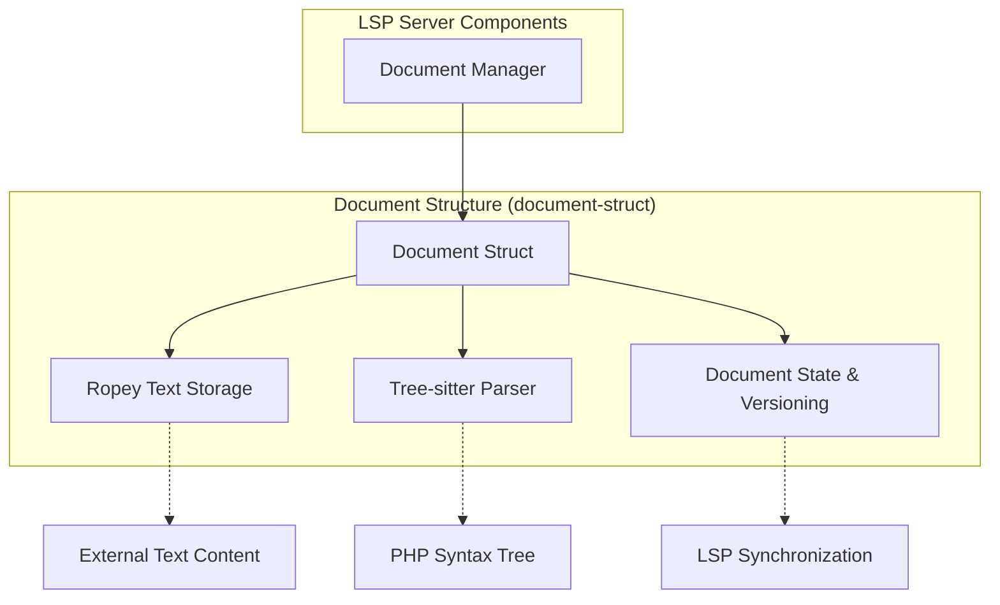
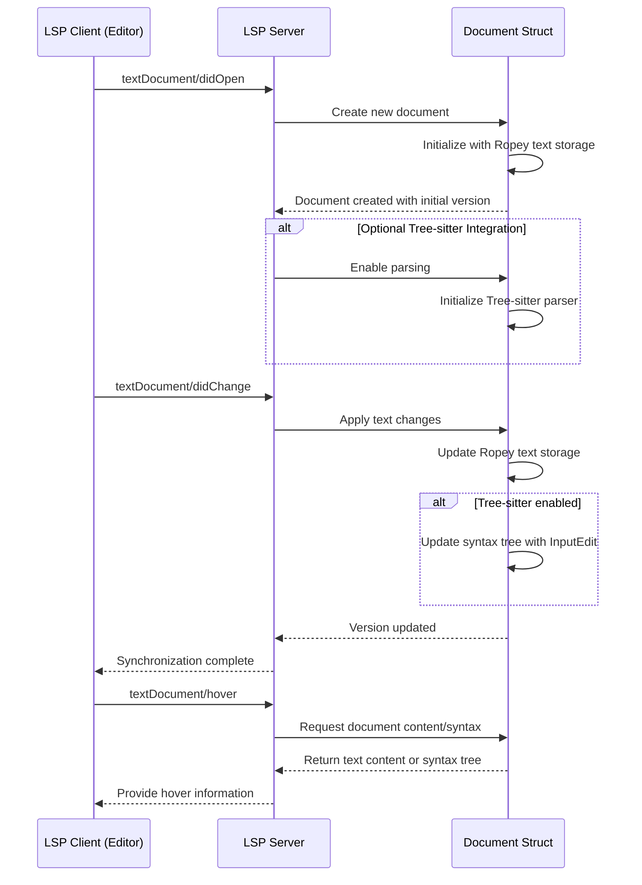

# Design Document Template

---
**Purpose**: Provide sufficient detail to ensure implementation consistency across different implementers, preventing interpretation drift.

**Approach**:
- Include essential sections that directly inform implementation decisions
- Omit optional sections unless critical to preventing implementation errors
- Match detail level to feature complexity
- Use diagrams and tables over lengthy prose

**Warning**: Approaching 1000 lines indicates excessive feature complexity that may require design simplification.
---

> Sections may be reordered (e.g., surfacing Requirements Traceability earlier or moving Data Models nearer Architecture) when it improves clarity. Within each section, keep the flow **Summary → Scope → Decisions → Impacts/Risks** so reviewers can scan consistently.

## Overview
The document-struct feature delivers efficient document representation with optional parsing capabilities to the PHP LSP server. This component serves as the foundational data structure for managing text content, supporting both simple text operations and sophisticated syntax-aware operations when needed.

**Users**: The PHP LSP server will utilize this for managing document state, text operations, and optionally for syntax analysis of PHP code.

**Impact**: Changes the current system by introducing a specialized document structure that supports efficient text handling with optional tree-sitter parsing integration, providing the foundation for high-performance document management in the LSP server.

### Goals
- Provide efficient text representation and operations using Ropey
- Support optional tree-sitter integration for syntax analysis
- Maintain document state and versioning for LSP synchronization
- Integrate seamlessly with the LSP protocol requirements
- Deliver optimal performance for large PHP documents

### Non-Goals
- Implement actual LSP protocol handling (handled by async-lsp)
- Provide language-specific PHP parsing logic (handled by tree-sitter-php)
- Implement user interface components
- Handle file system operations directly
- Provide complete text editor functionality

## Architecture

> Reference detailed discovery notes in `research.md` only for background; keep design.md self-contained for reviewers by capturing all decisions and contracts here.
> Capture key decisions in text and let diagrams carry structural detail—avoid repeating the same information in prose.

### Architecture Pattern & Boundary Map
**RECOMMENDED**: Include Mermaid diagram showing the chosen architecture pattern and system boundaries (required for complex features, optional for simple additions)



**Architecture Integration**:
- Selected pattern: State manager with synchronization - encapsulates both text handling and optional parsing
- Domain/feature boundaries: Document boundary encapsulates text operations, parsing, and state management
- Existing patterns preserved: Follows Rust-based LSP implementation patterns with async-lsp integration
- New components rationale: Required as foundational data structure for efficient document handling in LSP server
- Steering compliance: Aligns with Rust-based architecture and async-first design principle

### Technology Stack

| Layer | Choice / Version | Role in Feature | Notes |
|-------|------------------|-----------------|-------|
| Backend / Services | Ropey (latest stable) | Text storage and operations | Efficient rope-based text handling |
| Backend / Services | tree-sitter (0.25.1+) | Optional syntax parsing | Only when parsing needed |
| Backend / Services | tree-sitter-php | PHP-specific grammar | For PHP code parsing |
| Data / Storage | In-memory | Document state management | Ropey B-tree structure for efficiency |
| Infrastructure / Runtime | Rust (edition 2021) | Implementation language | Aligns with existing project tech stack |

> Keep rationale concise here and, when more depth is required (trade-offs, benchmarks), add a short summary plus pointer to the Supporting References section and `research.md` for raw investigation notes.

## System Flows



> Describe flow-level decisions (e.g., gating conditions, retries) briefly after the diagram instead of restating each step.

The flow demonstrates the document lifecycle from creation through text changes to feature requests. Key decisions include conditional tree-sitter initialization and synchronized updates between Ropey text storage and Tree-sitter syntax trees.

## Requirements Traceability

Map each requirement ID (e.g., `2.1`) to the design elements that realize it.

| Requirement | Summary | Components | Interfaces | Flows |
|-------------|---------|------------|------------|-------|
| 1.1, 1.2, 1.3, 1.4, 1.5 | Document structure with efficient text operations | Document Struct, Ropey Text Storage | Document API | Create document flow |
| 2.1, 2.2, 2.3, 2.4, 2.5 | Text handling with Ropey | Ropey Text Storage | Text operations API | Text change flow |
| 3.1, 3.2, 3.3, 3.4, 3.5 | Optional Tree-sitter integration | Tree-sitter Parser | Parsing API | Parsing flow |
| 4.1, 4.2, 4.3, 4.4, 4.5 | Document state management | Document State & Versioning | Versioning API | Version update flow |
| 5.1, 5.2, 5.3, 5.4, 5.5 | LSP protocol integration | Document Struct | LSP integration API | LSP synchronization flow |

> Omit this section only when a single component satisfies a single requirement without cross-cutting concerns.

## Components and Interfaces

Provide a quick reference before diving into per-component details.

- Summaries can be a table or compact list. Example table:
  | Component | Domain/Layer | Intent | Req Coverage | Key Dependencies (P0/P1) | Contracts |
  |-----------|--------------|--------|--------------|--------------------------|-----------|
  | Document Struct | Core Data Structure | Main entry point for document operations | 1, 2, 3, 4, 5 | Ropey (P0), Tree-sitter (P0) | Service, State |
  | Ropey Text Storage | Text Operations | Efficient text handling using rope data structure | 1.1, 1.2, 1.3, 1.4, 1.5, 2.1, 2.2, 2.3, 2.4, 2.5 | None | Service |
  | Tree-sitter Parser | Parsing | Optional syntax tree management | 3.1, 3.2, 3.3, 3.4, 3.5 | Document Struct (P0) | Service |
  | Document State & Versioning | State Management | Track document changes and versions | 4.1, 4.2, 4.3, 4.4, 4.5, 5.2, 5.4 | Ropey Text Storage (P0) | State |

### Core Document Layer

#### Document Struct

| Field | Detail |
|-------|--------|
| Intent | Main entry point for document operations, coordinating text handling, parsing, and state management |
| Requirements | 1.1, 1.2, 1.3, 1.4, 1.5, 2.1, 2.2, 2.3, 2.4, 2.5, 3.1, 3.2, 3.3, 3.4, 3.5, 4.1, 4.2, 4.3, 4.4, 4.5, 5.1, 5.2, 5.3, 5.4, 5.5 |
| Owner / Reviewers | (optional) |

**Responsibilities & Constraints**
- Primary responsibility: Centralize document operations including text handling, optional parsing, and state tracking
- Domain boundary: Encapsulates all document-related functionality
- Data ownership: Manages relationships between text storage, parsing state, and version information

**Dependencies**
- Inbound: LSP Server components — document operations (P0)
- Outbound: Ropey Text Storage — text operations (P0)
- Outbound: Tree-sitter Parser — syntax tree operations (P1)
- Outbound: Document State & Versioning — version management (P0)

Summarize external dependency findings here; deeper investigation (API signatures, rate limits, migration notes) lives in `research.md`.

**Contracts**: Service [X] / API [X] / Event [ ] / Batch [ ] / State [X]  ← check only the ones that apply.

##### Service Interface
```rust
pub struct Document {
    text_storage: RopeyTextStorage,
    parser: Option<TreeSitterParser>,
    state: DocumentState,
    uri: Url,
}

impl Document {
    pub fn new(content: &str, uri: Url) -> Result<Self, DocumentError>;
    pub fn with_tree_sitter(content: &str, uri: Url) -> Result<Self, DocumentError>;
    pub fn apply_changes(&mut self, changes: &[TextDocumentContentChangeEvent]) -> Result<(), DocumentError>;
    pub fn get_text(&self) -> RopeSlice;
    pub fn get_text_range(&self, start: usize, end: usize) -> RopeSlice;
    pub fn get_line(&self, line: usize) -> Option<RopeSlice>;
    pub fn get_position(&self, offset: usize) -> Option<(usize, usize)>;  // (line, col)
    pub fn get_length(&self) -> usize;
    pub fn get_version(&self) -> i32;
    pub fn increment_version(&mut self);
    pub fn get_syntax_tree(&self) -> Option<&Tree>;
    pub fn get_uri(&self) -> &Url;
}
```
- Preconditions: Content and URI must be valid
- Postconditions: Document is initialized with specified content and version set to initial value
- Invariants: Text and optional syntax tree remain synchronized when both are active

**Implementation Notes**
- Integration: Follows LSP URI scheme requirements
- Validation: Validate URI format and content UTF-8 encoding
- Risks: Complex synchronization between text and syntax tree

#### Ropey Text Storage

| Field | Detail |
|-------|--------|
| Intent | Efficient text storage and operations using Ropey rope data structure |
| Requirements | 1.1, 1.2, 1.3, 1.4, 1.5, 2.1, 2.2, 2.3, 2.4, 2.5 |
| Owner / Reviewers | (optional) |

**Responsibilities & Constraints**
- Primary responsibility: Provide efficient text operations using Ropey
- Domain boundary: Encapsulates rope-based text handling
- Data ownership: Maintains the rope data structure and associated operations

**Dependencies**
- Inbound: Document Struct — text operations (P0)
- External: Ropey crate — text storage implementation (P0)

**Contracts**: Service [X] / API [ ] / Event [ ] / Batch [ ] / State [X]  ← check only the ones that apply.

##### Service Interface
```rust
pub struct RopeyTextStorage {
    rope: Rope,
}

impl RopeyTextStorage {
    pub fn new(content: &str) -> Self;
    pub fn from_rope(rope: Rope) -> Self;
    pub fn get_text(&self) -> &Rope;
    pub fn get_slice(&self, start: usize, end: usize) -> Option<RopeSlice>;
    pub fn get_line(&self, line: usize) -> Option<RopeSlice>;
    pub fn get_char(&self, idx: usize) -> Option<char>;
    pub fn get_byte(&self, idx: usize) -> Option<u8>;
    pub fn len_chars(&self) -> usize;
    pub fn len_bytes(&self) -> usize;
    pub fn len_lines(&self) -> usize;
    pub fn insert(&mut self, pos: usize, text: &str) -> Result<(), TextStorageError>;
    pub fn delete(&mut self, start: usize, end: usize) -> Result<(), TextStorageError>;
    pub fn slice(&self, start: usize, end: usize) -> Result<RopeSlice, TextStorageError>;
}
```
- Preconditions: Valid UTF-8 content, valid indices
- Postconditions: Text operations completed successfully
- Invariants: Maintains valid UTF-8 sequences

**Implementation Notes**
- Integration: Direct wrapper around Ropey functionality
- Validation: Validate indices are within bounds
- Risks: None significant

#### Tree-sitter Parser

| Field | Detail |
|-------|--------|
| Intent | Optional syntax tree management using Tree-sitter |
| Requirements | 3.1, 3.2, 3.3, 3.4, 3.5 |
| Owner / Reviewers | (optional) |

**Responsibilities & Constraints**
- Primary responsibility: Provide syntax tree access and synchronization with text changes
- Domain boundary: Encapsulates parsing and tree management
- Data ownership: Maintains syntax tree and parsing state

**Dependencies**
- Inbound: Document Struct — parsing operations (P0)
- Inbound: Ropey Text Storage — text for parsing (P0)
- External: tree-sitter-php — PHP grammar (P0)

**Contracts**: Service [X] / API [ ] / Event [ ] / Batch [ ] / State [ ]  ← check only the ones that apply.

##### Service Interface
```rust
pub struct TreeSitterParser {
    parser: tree_sitter::Parser,
    tree: Option<tree_sitter::Tree>,
    language: tree_sitter_php::Language,
}

impl TreeSitterParser {
    pub fn new() -> Result<Self, ParserError>;
    pub fn parse_text(&mut self, text: &str) -> Result<(), ParserError>;
    pub fn parse_text_with_ropes(&mut self, rope: &Rope) -> Result<(), ParserError>;
    pub fn parse_text_incrementally(&mut self, old_text: &Rope, new_text: &Rope, edit: InputEdit) -> Result<(), ParserError>;
    pub fn get_tree(&self) -> Option<&tree_sitter::Tree>;
    pub fn update_with_edit(&mut self, edit: InputEdit) -> Result<(), ParserError>;
}
```
- Preconditions: Valid PHP text content
- Postconditions: Syntax tree is updated to match text
- Invariants: Syntax tree remains valid after text changes

**Implementation Notes**
- Integration: Works with Ropey through text callbacks
- Validation: Validate syntax tree integrity after updates
- Risks: Complex synchronization between Ropey storage and syntax tree

#### Document State & Versioning

| Field | Detail |
|-------|--------|
| Intent | Track document changes and maintain version for LSP synchronization |
| Requirements | 4.1, 4.2, 4.3, 4.4, 4.5, 5.2, 5.4 |
| Owner / Reviewers | (optional) |

**Responsibilities & Constraints**
- Primary responsibility: Maintain document version and synchronization state
- Domain boundary: Encapsulates version tracking and state management
- Data ownership: Maintains version number and synchronization status

**Dependencies**
- Inbound: Document Struct — state updates (P0)
- Outbound: Ropey Text Storage — for state consistency (P0)

**Contracts**: Service [ ] / API [ ] / Event [ ] / Batch [ ] / State [X]  ← check only the ones that apply.

##### State Management
- State model: Version number (i32), URI, synchronized flag
- Persistence & consistency: In-memory, consistent with document content
- Concurrency strategy: Single-threaded access via Document Struct

**Implementation Notes**
- Integration: Updates version when document content changes
- Validation: Verify version increases monotonically
- Risks: Inconsistent state if not properly synchronized with text changes

## Data Models

Focus on the portions of the data landscape that change with this feature.

### Domain Model
- **Document Aggregate**: Root entity containing text, optional syntax tree, and state
  - **Document Entity**: Contains URI, version, text storage, and optional parser
  - **Text Storage Value Object**: Encapsulates Ropey rope with text operations
  - **Parse State Value Object**: Contains syntax tree when parsing is enabled
- Transactional boundaries: Document changes are atomic operations
- Business rules & invariants: Document text and syntax tree remain synchronized when both present

### Logical Data Model

**Structure Definition**:
- Document: Contains uri: Url, version: i32, text_storage: RopeyTextStorage, parser: Option<TreeSitterParser>
- Text Storage: Contains rope: Rope data structure with efficient operations
- Parse State: Contains tree: Option<Tree> representing the syntax tree

**Consistency & Integrity**:
- Transaction boundaries: Individual document operations are atomic
- Cascading rules: N/A
- Temporal aspects: Version number increments with each change

## Error Handling

### Error Strategy
Concrete error handling patterns and recovery mechanisms for each error type.

### Error Categories and Responses
**User Errors** (4xx): Invalid document content → content validation; Invalid URI → URI validation; Invalid text position → bounds checking
**System Errors** (5xx): Tree-sitter parsing failure → fallback to text-only mode; Memory exhaustion → proper error propagation; Library initialization failures → initialization validation
**Business Logic Errors** (422): Mismatched document state → internal consistency checks; Inconsistent edit operations → validation of edit params

### Monitoring
Error tracking, logging, and health monitoring implementation.
- Log all parsing failures and text operation errors
- Track document operation performance
- Monitor memory usage for large documents

## Testing Strategy

### Default sections (adapt names/sections to fit the domain)
- Unit Tests: Document creation and initialization, Text operations with Ropey, Incremental parsing updates, Version management, Error handling
- Integration Tests: Document creation with tree-sitter, Text change synchronization with syntax tree, LSP synchronization flow, Performance with large documents
- E2E/UI Tests (if applicable): N/A for this component
- Performance/Load (if applicable): Large document handling, Concurrent document operations, Memory usage under load

## Optional Sections (include when relevant)

### Security Considerations
_Use this section for features handling auth, sensitive data, external integrations, or user permissions. Capture only decisions unique to this feature; defer baseline controls to steering docs._
- No special authentication or authorization needed
- Input validation for document content and URIs
- No sensitive data handling

### Performance & Scalability
_Use this section when performance targets, high load, or scaling concerns exist. Record only feature-specific targets or trade-offs and rely on steering documents for general practices._
- Target: Handle documents up to 10MB efficiently
- Scaling approaches: Ropey's B-tree structure for memory efficiency
- Caching strategies: Syntax tree caching when document is stable
- Optimization techniques: Incremental parsing to avoid full re-parsing on every change